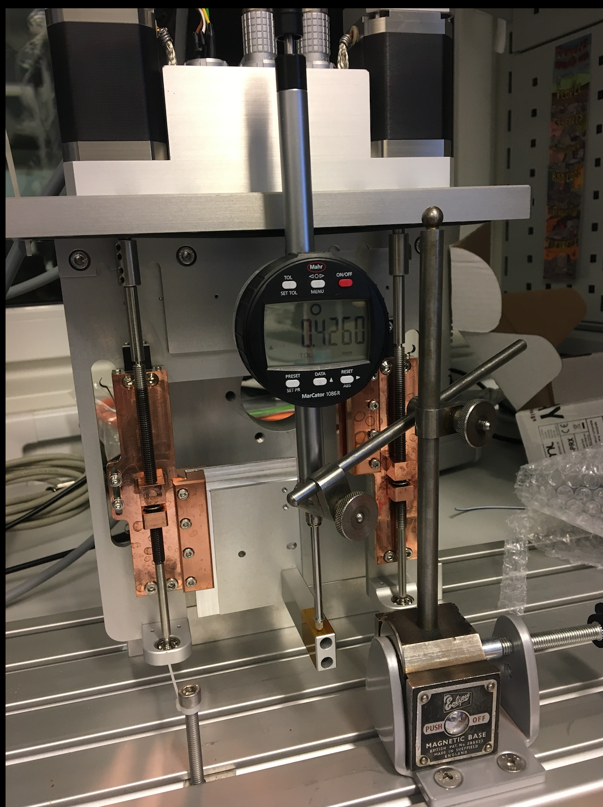

# Notes for SAT of slitset 11358

## Visual inspection

1. Axis 2 seems to be run into lower mech stop. Very stange way send away an slit set.


# Axi1

## General Comments

Seem to run much harder in one part of the rev since the sound is changing. "knarrande ljud"

## Switches

1. Correct and working!


## Resolver

Check resolversignal at standstill.

```
camonitor IOC_TEST:ec0-s4-EL7211-Enc-PosAct | tee axis1_resolver_standstill.log
```

### Resolver at different angles 


Starts at Angle x+0:
```
angle=0
camonitor IOC_TEST:ec0-s4-EL7211-Enc-PosAct IOC_TEST:Axis1-PosAct | tee axis1_standstill_x${angle}deg.log
cat axis1_standstill_x${angle}deg.log |grep 7211 | tail -n200 | python ~/projects/ecmccomgui/pyDataManip/histCaMonitor.py -t "Resolver jitter at x+${angle}deg" &

```
Angle x+45:

```
angle=45
camonitor IOC_TEST:ec0-s4-EL7211-Enc-PosAct IOC_TEST:Axis1-PosAct | tee axis1_standstill_x${angle}deg.log
cat axis1_standstill_x${angle}deg.log |grep 7211 | tail -n200 | python ~/projects/ecmccomgui/pyDataManip/histCaMonitor.py -t "Resolver jitter at x+${angle}deg" &

```
Angle x+90:
```
angle=90
camonitor IOC_TEST:ec0-s4-EL7211-Enc-PosAct IOC_TEST:Axis1-PosAct | tee axis1_standstill_x${angle}deg.log
cat axis1_standstill_x${angle}deg.log |grep 7211 | tail -n200 | python ~/projects/ecmccomgui/pyDataManip/histCaMonitor.py -t "Resolver jitter at x+${angle}deg" &

```
Angle x+135:
```
angle=135
camonitor IOC_TEST:ec0-s4-EL7211-Enc-PosAct IOC_TEST:Axis1-PosAct | tee axis1_standstill_x${angle}deg.log
cat axis1_standstill_x${angle}deg.log |grep 7211 | tail -n200 | python ~/projects/ecmccomgui/pyDataManip/histCaMonitor.py -t "Resolver jitter at x+${angle}deg" &

```
Angle x+180:
```
angle=180
camonitor IOC_TEST:ec0-s4-EL7211-Enc-PosAct IOC_TEST:Axis1-PosAct | tee axis1_standstill_x${angle}deg.log
cat axis1_standstill_x${angle}deg.log |grep 7211 | tail -n200 | python ~/projects/ecmccomgui/pyDataManip/histCaMonitor.py -t "Resolver jitter at x+${angle}deg" &

```
Angle x+225:
```
angle=225
camonitor IOC_TEST:ec0-s4-EL7211-Enc-PosAct IOC_TEST:Axis1-PosAct | tee axis1_standstill_x${angle}deg.log
cat axis1_standstill_x${angle}deg.log |grep 7211 | tail -n200 | python ~/projects/ecmccomgui/pyDataManip/histCaMonitor.py -t "Resolver jitter at x+${angle}deg" &

```
Angle x+270:
```
angle=270
camonitor IOC_TEST:ec0-s4-EL7211-Enc-PosAct IOC_TEST:Axis1-PosAct | tee axis1_standstill_x${angle}deg.log
cat axis1_standstill_x${angle}deg.log |grep 7211 | tail -n200 | python ~/projects/ecmccomgui/pyDataManip/histCaMonitor.py -t "Resolver jitter at x+${angle}deg" &
```
Angle x+315:
```
angle=315
camonitor IOC_TEST:ec0-s4-EL7211-Enc-PosAct IOC_TEST:Axis1-PosAct | tee axis1_standstill_x${angle}deg.log
cat axis1_standstill_x${angle}deg.log |grep 7211 | tail -n200 | python ~/projects/ecmccomgui/pyDataManip/histCaMonitor.py -t "Resolver jitter at x+${angle}deg" &

```
Angle x+360:
```
angle=360
camonitor IOC_TEST:ec0-s4-EL7211-Enc-PosAct IOC_TEST:Axis1-PosAct | tee axis1_standstill_x${angle}deg.log
cat axis1_standstill_x${angle}deg.log |grep 7211 | tail -n200 | python ~/projects/ecmccomgui/pyDataManip/histCaMonitor.py -t "Resolver jitter at x+${angle}deg" &
```

## Motor
Motor and PT100 in same connector (7pin lemo)
Need to make own cable since no standard 7pin cable available:

```
A+ brown
A- white
B+ greeń
B- yellow

PT100+ gray
PT100- pink

```

### Motor phase resistance
Phase A 8.5Ohm OK!
Phase B 8.5Ohm OK!


### Motor first move
Config works and motor moves smooth in correct direction


### Resolver vs openloop counter
```
camonitor IOC_TEST:ec0-s4-EL7211-Enc-PosAct IOC_TEST:Axis1-PosAct | tee axis1_resolver_openloop.log
```

Works fine!


## Switch repeatability

### Low Lim (10 repeats)
Velocity 0.25 I think..
```
camonitor -g10 -n IOC_TEST:ec0-s4-EL7211-Enc-PosAct IOC_TEST:Axis1-PosAct IOC_TEST:ec0-s2-EL1808-BI1  | tee axis1_switch_lowlim.log
cat axis1_switch_lowlim.log | python ~/projects/ecmccomgui/pyDataManip/plotCaMonitor.py 
```

### High Lim (10 repeats)
Velocity 0.25 I think..
```
camonitor -g10 -n IOC_TEST:ec0-s4-EL7211-Enc-PosAct IOC_TEST:Axis1-PosAct IOC_TEST:ec0-s2-EL1808-BI2  | tee axis1_switch_highlim.log
cat axis1_switch_highlim.log | python ~/projects/ecmccomgui/pyDataManip/plotCaMonitor.py 
```

### Repeatability from below (moving from below)

* 10 times from one directions to same target and read the two feedbacks.\
* Homing first at low limit (sequence 1)
* Tests at 20 40 60
* Reset dail to 0 at pos 20




#### Position 20
Reset dail to 0 at pos 20
```
camonitor -g10 -n IOC_TEST:ec0-s4-EL7211-Enc-PosAct IOC_TEST:Axis1-PosAct | tee axis1_repeat_pos20.log
cat axis1_repeat_pos20.log | python ~/projects/ecmccomgui/pyDataManip/plotCaMonitor.py &

```
Test | Pos20| Pos19.5| 
--- | --- | --- |
1  |  0.0010 | -0.4760
2  |  0.0010 | -0.4765
3  |  0.0015 | -0.4770
4  |  0.0020 | -0.4780
5  |  0.005  | -0.4785
6  |  -0.001 | -0.4790
7  |  0.000  | -0.4795
8  |  0.0015 | -0.4800
9  |  0.005  | -0.4805
10 |  -0.001 | -0.4815


#### Position 40
Reset dail to 0 at pos 20
```
camonitor -g10 -n IOC_TEST:ec0-s4-EL7211-Enc-PosAct IOC_TEST:Axis1-PosAct | tee axis1_repeat_pos40.log
cat axis1_repeat_pos40.log | python ~/projects/ecmccomgui/pyDataManip/plotCaMonitor.py &

```
Test | Pos40| Pos39.5| 
--- | --- | --- |
1  | 19.9485  | 19.4675
2  | 19.9475  | 19.4660
3  | 19.9470  | 19.4655
4  | 19.9470  | 19.4650
5  | 19.9465  | 19.4630
6  | 19.9465  | 19.4620
7  | 19.9455  | 19.4615
8  | 19.9445  | 19.4615
9  | 19.9440  | 19.4605
10 | 19.9430  | 19.4585

#### Position 60
Reset dail to 0 at pos 20
```
camonitor -g10 -n IOC_TEST:ec0-s4-EL7211-Enc-PosAct IOC_TEST:Axis1-PosAct | tee axis1_repeat_pos60.log
cat axis1_repeat_pos60.log | python ~/projects/ecmccomgui/pyDataManip/plotCaMonitor.py &

```
Test | Pos60| Pos59.5| 
--- | --- | --- |
1  | 39.8950  | 39.4175
2  | 39.8940  | 39.7160
3  | 39.8925  | 39.4160
4  | 39.8920  | 39.4155
5  | 39.8915  | 39.4150
6  | 39.8910  | 39.4145
7  | 39.8905  | 39.4130
8  | 39.8895  | 39.4120
9  | 39.8890  | 39.4115
10 | 39.8885  | 39.4110

### Repeatability from top (moving from top)
 Same coord dail zero as previous test

#### Position 20
Reset dail to 0 at pos 20
```
camonitor -g10 -n IOC_TEST:ec0-s4-EL7211-Enc-PosAct IOC_TEST:Axis1-PosAct | tee axis1_repeat_pos20_above.log
cat axis1_repeat_pos20_above.log | python ~/projects/ecmccomgui/pyDataManip/plotCaMonitor.py &

```

Test | Pos20| Pos20.5| 
--- | --- | --- |
1  | -0.0620 | 0.4270
2  | -0.0625 | 0.4265
3  | -0.0625 | 0.4265
4  | -0.0630 | 0.4265
5  | -0.0630 | 0.4265
6  | -0.0630 | 0.4265
7  | -0.0630 | 0.4260
8  | -0.0630 | 0.4260
9  | -0.0630 | 0.4260
10 | -0.0625 | 0.4250

#### Position 40
Reset dail to 0 at pos 20
```
camonitor -g10 -n IOC_TEST:ec0-s4-EL7211-Enc-PosAct IOC_TEST:Axis1-PosAct | tee axis1_repeat_pos40_above.log
cat axis1_repeat_pos40_above.log | python ~/projects/ecmccomgui/pyDataManip/plotCaMonitor.py &

```

Test | Pos40| Pos40.5| 
--- | --- | --- |
1  | 19.8970 | 20.3895
2  | 19.8970 | 20.3890
3  | 19.8970 | 20.3890
4  | 19.8965 | 20.3890
5  | 19.8960 | 20.3885
6  | 19.8960 | 20.3885
7  | 19.8960 | 20.3880
8  | 19.8960 | 20.3885
9  | 19.8955 | 20.3880
10 | 19.8955 | 20.3890

### Position 60
Reset dail to 0 at pos 20
```
camonitor -g10 -n IOC_TEST:ec0-s4-EL7211-Enc-PosAct IOC_TEST:Axis1-PosAct | tee axis1_repeat_pos60_above.log
cat axis1_repeat_pos60_above.log | python ~/projects/ecmccomgui/pyDataManip/plotCaMonitor.py &

```

Test | Pos60| Pos60.5| 
--- | --- | --- |
1  | 39.8755 | 40.3685
2  | 39.8750 | 40.3670
3  | 39.8745 | 40.3670
4  | 39.8740 | 40.3660
5  | 39.8740 | 40.3665
6  | 39.8735 | 40.3655
7  | 39.8730 | 40.3650
8  | 39.8730 | 40.3645
9  | 39.8725 | 40.3640
10 | 39.8715 | 40.3640


# Axis 2


